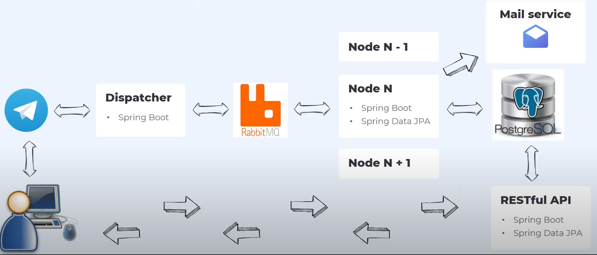
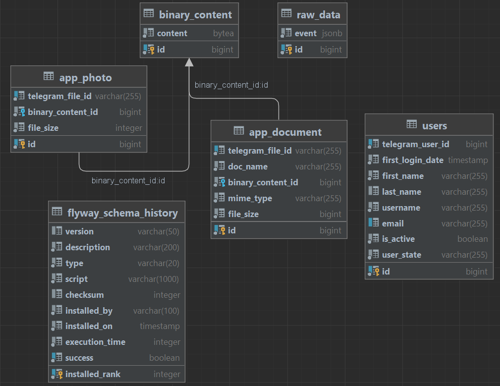

# Shulan-Bot

*Telegram bot - File sharing application*  
(Ready for deployment on a VPS server)

## Application structure

The application has a microservice architecture.

### Modules:

- `dispatcher` - microservice for initial verification of incoming data and distribution of messages to appropriate
  queues in the RabbitMQ message broker;
- `node` - message processing microservice from RabbitMQ:
    - user registration;
    - saving messages from Telegram to the database;
    - message processing: **text**, **document**, **photo**;
    - saving file to database;
    - creating links to download files;
    - sending a response to the RabbitMQ;
- `mail-service` - microservice for sending an email with a link to confirm registration;
- `rest-service` - microservice for downloading files from the database using a link;
    - user activation confirmation;
    - downloading files from database;
- `common` - contains general code for interacting with the database and code for encrypting and decrypting identifiers;

### Database Structure:

### Common Stack:

- Java 21
- Spring Boot 3
- PostgreSQL
- RabbitMQ
- Docker
- Lombok

#### Dispatcher:

- Spring Web
- [Telegram Bot Java Library](https://github.com/rubenlagus/TelegramBots) 
  `Supports both Webhooks and Long Polling methods` 
  `For WebHooks I used the proxy server` [Serveo](https://serveo.net/)

#### Node:

- Spring Web
- Spring Data JPA
- Testcontainers : PostgreSQL
- Hypersistence Utilities Hibernate 60
- Jakarta Mail API
- Flyway

#### Mail Service:

- Spring Web
- Java Mail Service

#### Rest Service

- Spring Data JPA
- Spring Web

#### Common:

- Spring Data JPA
- Hashids

**Also, everything is ready for deployment on a VPS server, in particular on Beget**.

To first deploy your application to a VPS, you need to:

1. create your Telegram bot and fill in `TG_BOT_NAME` and `TG_BOT_TOKEN` in the **.env** file
2. create your mail server and fill
   in: `MAIL_HOST``MAIL_PORT`, `MAIL_PROTOCOL`, `MAIL_USERNAMEMAIL_USERNAME`, `MAIL_PASSWORD` in the **.env** file
3. change `RABBIT_USERNAME`, `RABBIT_PASSWORD`, `POSTGRES_USERNAME`, `POSTGRES_PASSWORD` in the **.env** file
4. run each of the commands in the **deploy_instruction.text** file
5. after step 2 from the **deploy_instruction.text** file change `HOST_URL`, `TG_BOT_URI`, `ACTIVATION_URI` in **.env**
   file
6. after step 25 from the **deploy_instruction.text** file change `TRAEFIK_PASSWORD`